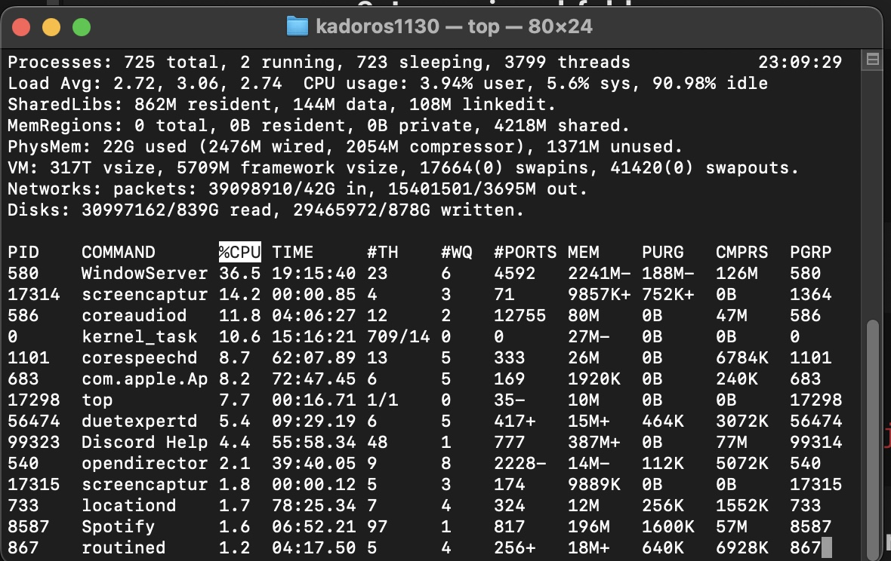
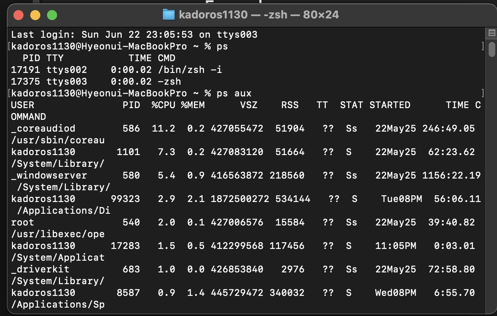
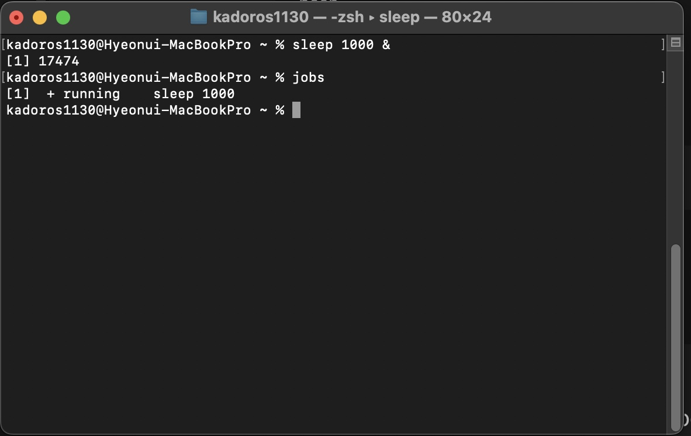

# top

- 실시간 시스탬 정보를 보여줌

- 윈도우의 작업관리자와 비슷함

``` bash 
top 
```



# ps

- 지금 실행되고 있는 프로세스들을 보여줌
``` bash 
ps 
```
- aux 옵션을 붙이면 모든 프로세스를 전체 사용자 기준으로 출력
- a 는 모든 유저의 
- u 유저 인풋
- x 터미널에 붙어 있지 않은 프로세스들도 
``` bash 
ps aux
```




# jobs

- 현재 백그라운드 작업이나 일시 정지된 작업을 출력

- 현제 열여있고 이 명령어를 쓰는 터미널에 한정됨

``` bash 
sleep 10000 &
jobs 
```



# kill

- 프로세스에 신호(종료 또는 종료 등)를 보냅니다.


``` bash 
kill [process_number]
```

